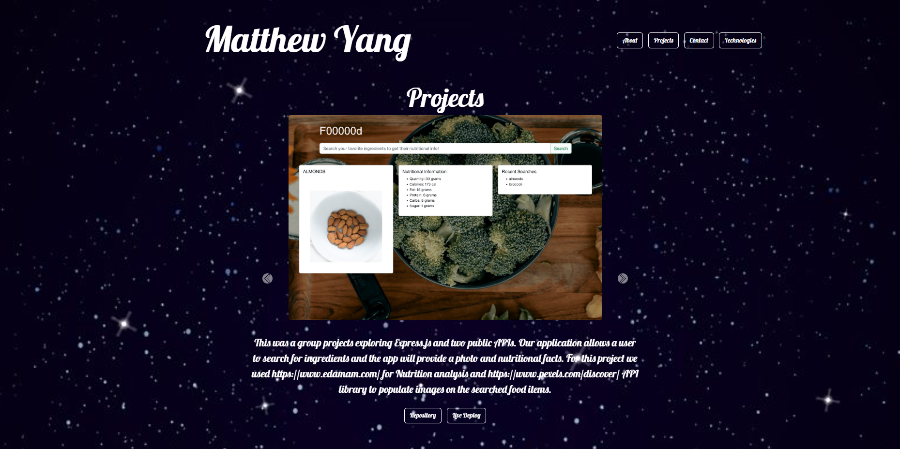

## myReactPortfolio

---

## Table on Contents

1. [License](#License)
2. [Description](#Description)
3. [Installation](#Installation)
4. [Usage](#Usage)
5. [Questions](#Questions)

---

## License

---

## Description

This project showcases my professional portfolio build with React. Modules such as react, react-router-dom, and react-bootstrap is used to dynamically render the application without calling back to a server. This optimizes the performance of the web-app and is clear why React is highly used. React allows us the manipulate the virtual dom which proves a positive user experience, allowing the user to seamlessly traverse the web application. Vanilla Javascript and Node.js is also used in the applications to hand useEffects and Events. To put my personal touches to the styling I also used CSS to style/customize particular elements

---

## Installation

No install necessary, view live deploy here:
https://myang5t3r.github.io/myReactPortfolio/

---

## Usage

Navigate to live deploy and view About, Project, Contact, and Technologies pages. You can use the buttons on the projects carousel to launch the github repository and the live deployment of each application. The icons in the footer section are links to my LinkedIn, Github and to download my current resume.

## Questions

For more information and questions please email me @ yangmatthew85@gmail.com
Or you are welcome to use the Contact page form to send the email. The email service is setup with Emailjs.

[GitHub: myang5t3r](https://github.com/myang5t3r)

---
